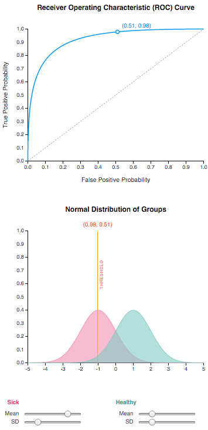

# Understanding Receiver Operating Characteristic (ROC) Curves

In this project, we demonstrate Receiver Operating Characteristic
(ROC) Curves by implementing an interactive visualisation using
JavaScript and CSS. View the demo as follows:

    $ cd roc
    $ python -m SimpleHTTPServer

